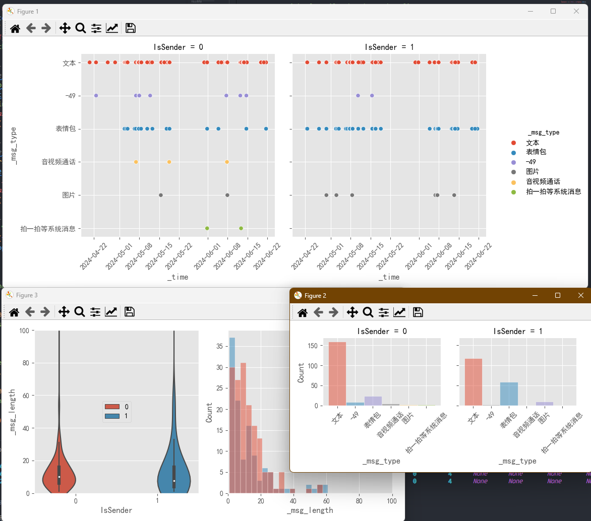

# Try to Read WeChat db

Successfully parse my chat records in my own WeChat folder.
The code only works for WeChat 3.? versions.
But it fails on newer 4.? versions.

Fuck WeChat.

---

[toc]

## Got WeChat Key

Tried <https://github.com/ycccccccy/wx_key.git>, but it doesn't work.

## Simple to use

There are two scripts of interest and they are simple to use.

The [./read-wechat-data.py](./read-wechat-data.py) does two things:

- `get_key(WeChatFolder, 8)` gets the key of the WeChat db;
- `parse_db(key, WeChatFolder, output_dir)` reads the db and put them into [./output](./output) folder after decryption;
- After execution, it generates about `1GB` .db files in the [./output](./output) folder.

The [./example-analysis.py](./example-analysis.py) does two things:

- Analysis MicroMsg.db and MSG7.db (see examples for detail);
- Yields the graph result as following.



## Example: MicroMsg.db

The Contact table contains the contact information.

```shell
---- Found table_names: ----
[
    ('Contact',),
    ('OpLog',),
    ('Session',),
    ('AppInfo',),
    ('ContactHeadImgUrl',),
    ('BizInfo',),
    ('TicketInfo',),
    ('ChatRoom',),
    ('ChatRoomInfo',),
    ('MainConfig',),
    ('RevokeMsgStorage',),
    ('BizProfileV2',),
    ('BizName2ID',),
    ('BizProfileInfo',),
    ('BizSessionNewFeeds',),
    ('ContactLabel',),
    ('DelayDownLoad',),
    ('FTSContactTrans',),
    ('FTSChatroomTrans',),
    ('ChatLiveInfo',),
    ('PatInfo',),
    ('ChatInfo',),
    ('TopStoryReddotInfo',),
    ('ChatroomTool',)
]

---- Table Contact contains columns: ----
[
    (0, 'UserName', 'TEXT', 0, None, 1),
    (1, 'Alias', 'TEXT', 0, None, 0),
    (2, 'EncryptUserName', 'TEXT', 0, None, 0),
    (3, 'DelFlag', 'INTEGER', 0, '0', 0),
    (4, 'Type', 'INTEGER', 0, '0', 0),
    (5, 'VerifyFlag', 'INTEGER', 0, '0', 0),
    (6, 'Reserved1', 'INTEGER', 0, '0', 0),
    (7, 'Reserved2', 'INTEGER', 0, '0', 0),
    (8, 'Reserved3', 'TEXT', 0, None, 0),
    (9, 'Reserved4', 'TEXT', 0, None, 0),
    (10, 'Remark', 'TEXT', 0, None, 0),
    (11, 'NickName', 'TEXT', 0, None, 0),
    (12, 'LabelIDList', 'TEXT', 0, None, 0),
    (13, 'DomainList', 'TEXT', 0, None, 0),
    (14, 'ChatRoomType', 'INT', 0, None, 0),
    (15, 'PYInitial', 'TEXT', 0, None, 0),
    (16, 'QuanPin', 'TEXT', 0, None, 0),
    (17, 'RemarkPYInitial', 'TEXT', 0, None, 0),
    (18, 'RemarkQuanPin', 'TEXT', 0, None, 0),
    (19, 'BigHeadImgUrl', 'TEXT', 0, None, 0),
    (20, 'SmallHeadImgUrl', 'TEXT', 0, None, 0),
    (21, 'HeadImgMd5', 'TEXT', 0, None, 0),
    (22, 'ChatRoomNotify', 'INTEGER', 0, '0', 0),
    (23, 'Reserved5', 'INTEGER', 0, '0', 0),
    (24, 'Reserved6', 'TEXT', 0, None, 0),
    (25, 'Reserved7', 'TEXT', 0, None, 0),
    (26, 'ExtraBuf', 'BLOB', 0, None, 0),
    (27, 'Reserved8', 'INTEGER', 0, '0', 0),
    (28, 'Reserved9', 'INTEGER', 0, '0', 0),
    (29, 'Reserved10', 'TEXT', 0, None, 0),
    (30, 'Reserved11', 'TEXT', 0, None, 0)
]
```

## Example: MSG7.db

It contains chats during certain dates.

```shell
---- Found table_names: ----
[('MSG',), ('MSGTrans',), ('Name2ID',), ('DBInfo',)]

---- Table MSG contains columns: ----
[
    (0, 'localId', 'INTEGER', 0, None, 1),
    (1, 'TalkerId', 'INT', 0, '0', 0),
    (2, 'MsgSvrID', 'INT', 0, None, 0),
    (3, 'Type', 'INT', 0, None, 0),
    (4, 'SubType', 'INT', 0, None, 0),
    (5, 'IsSender', 'INT', 0, None, 0),
    (6, 'CreateTime', 'INT', 0, None, 0),
    (7, 'Sequence', 'INT', 0, '0', 0),
    (8, 'StatusEx', 'INT', 0, '0', 0),
    (9, 'FlagEx', 'INT', 0, None, 0),
    (10, 'Status', 'INT', 0, None, 0),
    (11, 'MsgServerSeq', 'INT', 0, None, 0),
    (12, 'MsgSequence', 'INT', 0, None, 0),
    (13, 'StrTalker', 'TEXT', 0, None, 0),
    (14, 'StrContent', 'TEXT', 0, None, 0),
    (15, 'DisplayContent', 'TEXT', 0, None, 0),
    (16, 'Reserved0', 'INT', 0, '0', 0),
    (17, 'Reserved1', 'INT', 0, '0', 0),
    (18, 'Reserved2', 'INT', 0, '0', 0),
    (19, 'Reserved3', 'INT', 0, '0', 0),
    (20, 'Reserved4', 'TEXT', 0, None, 0),
    (21, 'Reserved5', 'TEXT', 0, None, 0),
    (22, 'Reserved6', 'TEXT', 0, None, 0),
    (23, 'CompressContent', 'BLOB', 0, None, 0),
    (24, 'BytesExtra', 'BLOB', 0, None, 0),
    (25, 'BytesTrans', 'BLOB', 0, None, 0)
]
```

## Reference

- Github: [https://github.com/LC044/WeChatMsg]()
- Zhihu:  [https://zhuanlan.zhihu.com/p/704293254?utm_id=0]()
